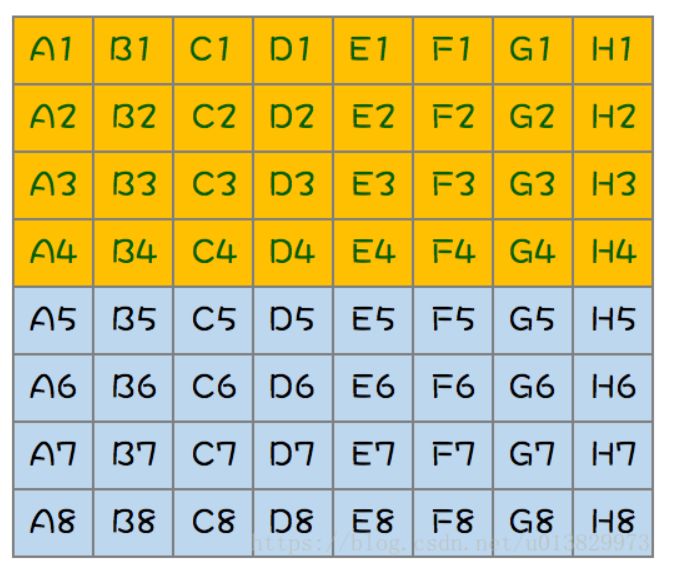
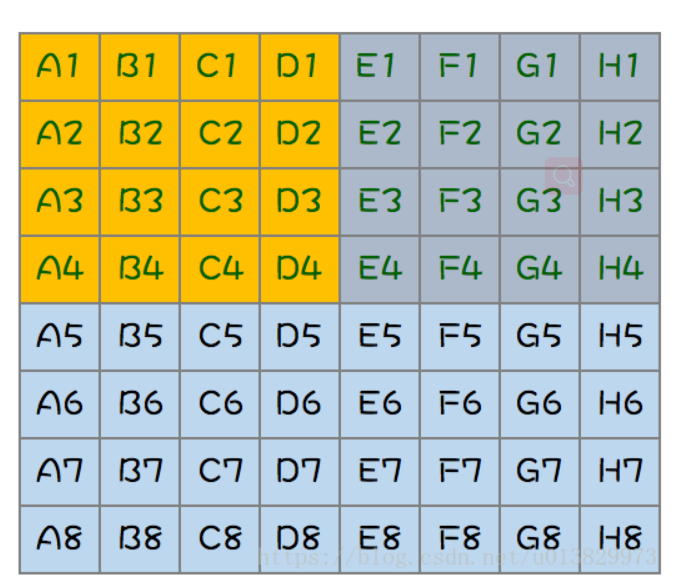

# 1. 64匹马，8个赛道，找出跑得最快的4匹马，至少比赛几场？

1. 第一步

    全部马分为8组，每组8匹，每组各跑一次，然后淘汰掉每组的后四名，如下图（需要比赛8场）

    

2. 第二步

    取每组第一名进行一次比赛，然后淘汰最后四名所在组的所有马，如下图（需要比赛1场）
    

    这个时候总冠军已经诞生，它就是A1，蓝色区域（它不需要比赛了），而其他可能跑得最快的三匹马只可能是下图中的黄色区域了（A2,A3,A4,B1,B2,B3,C1,C2,D1，共9匹马）

    

3. 第三步

    只要从上面的9匹马中找出跑得最快的三匹马就可以了，但是现在只要8个跑道，怎么办？那就随机选出8匹马进行一次比赛吧（需要比赛一场）

4. 第四步

    上面比赛完，选出了前三名，但是9匹马中还有一匹马没跑呢，**它可能是一个潜力股啊**，**那就和前三名比一比吧，这四匹马比一场，选出前三名**。最后加上总冠军，跑得最快的四匹马诞生了！！！（需要一场比赛）

最后，一共需要比赛的场次：8 + 1 + 1 + 1 = 11 场

# 2. 8个球其中一个轻球，分几次称找出来

两次

第一步：取出6个球，放在称两端

第二步：
根据上一步结果：

1. 若平衡，则轻球在另外两个

2. 若不平衡，选出轻的一端任选两个继续称，若平衡，则就是没称的那一个，若不平衡就是轻的一端

# 3. 100层楼，2个鸡蛋，鸡蛋从某一个临界楼层丢下会摔碎，请设计方案，能用最小的次数找到临界楼层

如果有两个鸡蛋，则第一个鸡蛋用来缩小查找的范围，因而把100层分成若干段，先利用一个鸡蛋来确定临界层所在的段，再利用另一个鸡蛋确定临界层，关键点在于如何分段。

比如说，每10层分一段，10,20,30...90，一共扔9次，在第90层碎了，那么第二鸡蛋从81到89，最坏的情况下还得扔9次，这种分段法不一定是最优的。

　　假设最坏的情况下，最少要x次才能找到临界楼层

　　　　如果在x层扔了后，没碎，则往上，到x+（x-1）层去扔，还没碎，则到x+（x-1）+（x-2）层去扔

　　　　如果在x层扔了后，碎了，则在1~x-1逐层往上扔

　　那么为什么是x+（x-1）层，这里假设x是10，x+（x-1）=19，在10,19层各扔一次，一共两次，11-18，最坏的情况下要8次，8+2正好=10

　　所以只要解出x+（x-1）+（x-2）+...+1>=100就行了，x最小为14

# 4. 24点游戏

常规的比如：
`3*8=24，4*6=24，2*12=24，24*1=24。`
频率略低一些的：
`25-1=24，23+1=24，22+2=24，15+9=24，28-4=24，36-12=24。`

# 5. 25匹马，5个跑道，如何通过最少的比赛次数确定前3名？

7次方法通64匹马选8匹最快

# 6. 一家人过桥问题

题目：

现在小明一家过一座桥，过桥时候是黑夜，所以必须有灯。现在小明过桥要1秒，小明的弟弟要3秒，小明的爸爸要6秒，小明的妈妈要8秒，小明的爷爷要12秒。每次此桥最多可过两人，而过桥的速度依过桥最慢者而定，而且灯在点燃后30秒就会熄灭。问小明一家如何过桥?

一、考虑到这座桥小明一秒就可以通过，可见桥是很短的，也就那么三四步路吧，那么灯光就可以照亮整座桥，那灯就不必往回送了。

此结果为：爷爷跟妈妈过桥，妈妈到达后，爷爷还要走4秒，这时爸爸跟上去，爷爷到后，（此时已经耗时12秒了）爸爸还要走两秒，弟弟跟上去，爸爸到后（此时共耗时14秒）弟弟还要走一秒，小明走上桥，与弟弟同时到达——总共15秒。
我百度了一下，发现这种情况很多人算的是19秒，得出这种答案的人只看到“过桥的速度依最慢者而定”，他没想到速度快的先到了，后面的还可以跟上，因为桥可以走两个人啊。不信你走走看，算算就知道了。

二、这种情况就比较复杂了，如果灯要往回送的话，就必须考虑谁先走，谁送灯，才能让时间最短。而此时，因为桥的这端没有灯，必须得等到灯送回来才能走。那么：

小明跟弟弟先过桥，耗时3秒；
小明送灯回，耗时1秒；
妈妈跟爷爷过桥，耗时12秒；
弟弟回，耗时3秒；
小明跟爸爸过桥，耗时6秒
小明回，耗时1秒；
小明跟弟弟过桥，耗时3秒
——总共耗时29秒。

[（笔试-智力测试）一家人过桥.....](https://blog.csdn.net/woshigaoyuan/article/details/13995999)

# 7. 3个鸡蛋测100层，扔鸡蛋不破的层数

当然还借鉴了B树的分层检索思想。

3个蛋其实就是多次分段的思想，和B树的思想很像。目的使各种最坏情况的投蛋次数都为t次

假设第一次分段：1------a1------a2-----a3----...---an,an=99，若在a1层蛋碎了（已经投了1次），还剩下2个蛋，在1---(a1-1)内第二次分段(利用上面的结论，为使最坏情况投蛋次数为t次，此段内2个蛋需要t-1次（因为已投了1次），那么需满足，f(t-1)=（t-1+1）*（t-1）/2>=a1-1);

同样若蛋在a1层未碎，则在a2层投一次（假设蛋碎了），那么在a1---(a2-1)内第二次分段(利用上面的结论，为使最坏情况投蛋次数相同，那么在此段内2个蛋需要t-2次(因为已投了2次)，那么需满足，f(t-2)=（t-2+1）*（t-2）/2>=a2-a1..    

以此内推，f(t-1)+f(t-2)+...+f(1)>=(a1-1)+（a2-a1）+..+(an-a..)=99，求最小的整数t。

 因此问题转换为：f(t)=（t+1）*t/2,求最小的正整数t，使得f(t-1)+f(t-2)+...+f(1)>=99；编程很容易求得最小的t为9；即3个蛋时，最坏需要9次投弹。
