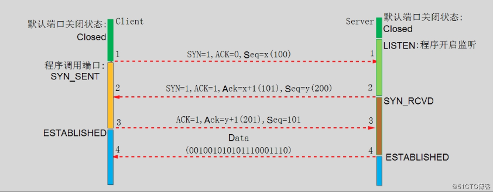
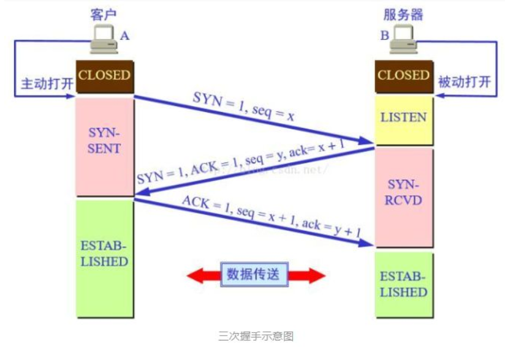
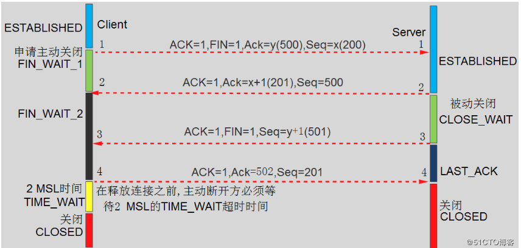
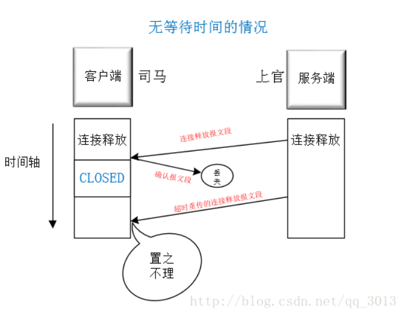

# 1. OSI7层及其作用
从底到上：

- 物理层：建立、维护、断开物理连接。
- 数据链路层：建立逻辑连接、进行硬件地址寻址、差错校验 等功能。（MAC地址）
- 网络层：进行逻辑地址寻址，实现不同网络之间的路径选择。（ICMP IGMP IP（IPV4 IPV6））
- 传输层：定义传输数据的协议端口号，以及流控和差错校验。（TCP，UDP）

- 会话层:建立、管理、终止会话
- 表示层:数据的表示、安全、压缩

- 应用层:网络服务与最终用户的一个接口。

# 2. TCP建立连接的三次握手
============================================================
[参考：简单的例子](https://blog.csdn.net/qq_35860138/article/details/82054793)

TCP 三次握手就好比两个人在街上隔着50米看见了对方，但是因为雾霾等原因不能100%确认，所以要通过招手的方式相互确定对方是否认识自己。

张三：向李四招手

李四：微笑（代表确认），并向张三招手

张三：微笑（代表确认）

两人就可以快速走到一起并交流

================================================

第一次握手：当客户端需要去建立连接时，客户端就会发送SYN包（seq=x）到服务器，然后客户端进入SYN_SEND的状态（代表已经发SYN包过去，并且在等待服务器确认）。

第二次握手：服务器收到SYN包，就会进行确认，由上面的标志位介绍我们可以知道SYN是表示同步序号，这时候会使得确认号=序号+1，（ack=x+1)，然后服务器也会像客户端发送一个SYN包（seq=y），这时候也就是服务器会发送SYN+ACK包，来表示服务器确认到了客户端的一次握手并且二次握手建立，此时服务器进入SYN_RECV状态。(SYN=1，ACK=1)，这时候由于是第二次握手，所以就会有一个服务器给客户端的确认标志。

第三次握手：客户端收到服务器的SYN+ACK包，然后就会像服务器发送确认包ACK（ack=k+1）和SYN（seq=x+1），等到这个包发送完毕之后客户端和服务器就会进入ESTABLISHED状态，完成三次握手，而后就可以在服务端和客户端之间传输数据。此时SYN标志位已经不需要，因为当我们发送ACK标志位的时候代表三次握手成功，已经建立完连接了，接下来可以传送数据过去了。

- 既然都有SYN包那为什么还要ACK来确认呢？

    **SYN是同步序号，当 SYN=1 而ACK=0 时，表明这是一个连接请求报文**。对方若同意建立连接，则应在响应报文中使 SYN=1 和 ACK=1。因此SYN置1就表示这是一个**连接请求或连接接受报文**。而ACK状态是用来确认是否同意连接。也就是传了 SYN，证明发送方到接收方的通道没有问题，但是接收方到发送方的通道还需要 ACK 信号来进行验证。

 

- 为什么不能两次握手？

   1. 为了防止已失效的连接请求报文段突然又传送到了服务端，因而产生错误.
   
   2. 防止server端一直等待，浪费资源。解释如下：

        假设不采用“三次握手”而是“两次握手”，那么只要server发出确认，新的连接就建立了。由于现在client并没有发出建立连接的请求，因此不会理睬server的确认，也不会向server发送数据。但server却以为新的运输连接已经建立，并一直等待client发来数据。这样，server的很多资源就白白浪费掉了。采用“三次握手”的办法可以防止上述现象发生。例如刚才那种情况，client不会向server的确认发出确认。server由于收不到确认，就知道client并没有要求建立连接。

# 2. TCP断开连接的四次握手？可以三次么？为什么要4次？

第一次握手：客户端发送一个FIN和序号过去（seq=u），用来表示客户端和服务端之间有关闭的请求，同时关闭客户端到服务端的数据传送，客户端就进入FIN_WAIT_1的状态。

第二次握手：服务端收到FIN=1的标志位时，就会发送一个ACK标志位代表确认，然后确认序号就变成了收到的序号加1，即ack=u+1（FIN和SYN在这点上相同，但是作用不一样）这时候服务端进入CLOSE_WAIT状态，这是一个半关闭状态。只能服务端给客户端发送数据而客户端不能给服务端发送数据。

第三次握手：这次握手还是由服务端发起，这是服务端在传完最后的数据（没有就不传）就会发送一个FIN=1和ACK=1，且序号seq会改变（没有传数据则不变），而ack不变。这时候服务端就会进入LAST_ACK状态，表示最后确认一次。

第四次握手：客户端在接收到FIN之后，就会进入TIME_WAIT状态，接着就发送一个ACK和seq=u+1,ack=w+1给服务端，这时候服务端就会进入CLOSED状态。而客户端进入TIME_WAIT状态的时候必须要等待2MSL的时间才会关闭

- 为什么不是三次？
    [TCP断开连接为什么需要四次挥手？](https://blog.csdn.net/gx17864373822/article/details/105353832/)
    1. 闭连接时，当服务端收到对方的FIN报文通知时，它仅仅表示对方（客户端）没有数据发送给你了；但未必你（服务端）所有的数据都全部发送给对方了。

    2. 关闭连接时，当Server端收到FIN报文时，很可能并不会立即关闭 SOCKET，所以只能先回复一个ACK报文，告诉Client端，“你发的FIN报文我收到了”。只有等到我Server端所有的报文都发送完了，我才能发送FIN报文，因此不能一起发送。故需要四步挥手。
    
    

    需要得到对方的确认,如果超过一定时间得不到确认会进行超时重传

    在等的这段时间，其实是要确保你的确认让对方收到，如果对方超时重传一个连接释放报文段，这个时候你还没有关闭，那你就可以重新发一个确认给他呀

    [简单的例子](https://blog.csdn.net/weixin_37891479/article/details/81012861)
- 为什么会有TIME_WAIT状态呢？（MSL：网络中数据报文存在的最大时间）   ---变相问题

    1、TIME_WAIT状态可以确保有足够的时间让对方接收到ACK包，如果ACK没有到达，在传输的过程丢失了或者一些其他原因，这样就可以让客户端重发ACK包。如果客户端直接关闭了，那么就有可能导致服务端在一些情况下没有接收到ACK包而无法与客户端断开连接。这样客户端发送ACK包到服务端，服务端请求重发，一来一回就正好是2MSL

    2、保证迟来的TCP报文段有足够的时间被识别并丢弃，linux 中一个TCPport不能打开两次或两次以上。当client处于time_wait状态时我们将无法使用此port建立新连接，假设不存在time_wait状态，新连接可能会收到旧连接的数据。

- 为什么客户端最后还要等待2MSL？

    MSL（Maximum Segment Lifetime），TCP允许不同的实现可以设置不同的MSL值。

    **第一，保证客户端发送的最后一个ACK报文能够到达服务器，因为这个ACK报文可能丢失**，站在服务器的角度看来，我已经发送了FIN+ACK报文请求断开了，客户端还没有给我回应，应该是我发送的请求断开报文它没有收到，于是服务器又会重新发送一次，而客户端就能在这个2MSL时间段内收到这个重传的报文，接着给出回应报文，并且会重启2MSL计时器。

    第二，防止类似与“三次握手”中提到了的“已经失效的连接请求报文段”出现在本连接中。客户端发送完最后一个确认报文后，在这个2MSL时间中，就可以使本连接持续的时间内所产生的所有报文段都从网络中消失。这样新的连接中不会出现旧连接的请求报文。

    **简而言之**：MSL是最长报文段寿命，设置的目的是：
            1. 保证A发送的最后一个ACK能够到达B
            2. 防止已失效的报文段出现在本连接中

参考链接：

[两张动图-彻底明白TCP的三次握手与四次挥手](https://blog.csdn.net/qzcsu/article/details/72861891) : 这个很详细

[TCP协议三次握手和四次握手机制-动画详解](https://blog.csdn.net/qq_35860138/article/details/82054793)

[TCP协议三次握手和四次握手](https://www.cnblogs.com/Cubemen/p/10803275.html)

[tcp断开连接为什么是4次挥手](https://blog.csdn.net/weixin_37891479/article/details/81012861)

[TCP的三次握手与四次挥手理解及面试题（很全面）](https://blog.csdn.net/qq_38950316/article/details/81087809?utm_medium=distribute.pc_relevant_t0.none-task-blog-BlogCommendFromMachineLearnPai2-1.nonecase&depth_1-utm_source=distribute.pc_relevant_t0.none-task-blog-BlogCommendFromMachineLearnPai2-1.nonecase)

# 3. 地址栏输入网址按回车的过程（输入 www.baidu.com 都会发生什么）
[【网络】 输入www.baidu.com后的过程详解](https://blog.csdn.net/yaotengjian/article/details/80457774)

1. 客户端浏览器通过DNS解析到www.baidu.com的IP地址220.181.27.48，通过这个IP地址找到客户端到服务器的路径。客户端浏览器发起一个HTTP会话到220.161.27.48，然后**通过TCP进行封装数据包**，输入到网络层。

    (DNS解析顺序

        1. 浏览器会按照一定频率缓存DNS记录
        2. 本地DNS缓存(内存中): 如果浏览器缓存中找不到需要的DNS记录，那就去操作系统找。
        3. 本地HOSTS文件: Windows系统中位于C:\Windows\System32\drivers\etc
        4. 路由器DNS(可以登录后台设置DNS服务器地址)
        5. ISP的DNS服务器
        6. 根服务器
    )

2. 在客户端的传输层，把HTTP会话请求分成报文段，添加源和目的端口，如服务器使用80端口监听客户端的请求，客户端由系统随机选择一个端口如5000，与服务器进行交换，服务器把相应的请求返回给客户端的5000端口。然后使用IP层的IP地址查找目的端。

3. 客户端的网络层不用关心应用层或者传输层的东西，主要做的是**通过查找路由表确定如何到达服务器**，期间可能经过多个路由器，是通过查找路由表决定通过那个路径到达服务器。

4. 客户端的链路层，包通过链路层发送到路由器，通过邻居协议查找给定IP地址的MAC地址，然后发送ARP请求查找目的地址，如果得到回应后就可以使用ARP的请求应答交换的IP数据包现在就可以传输了，然后发送IP数据包到达服务器的地址。

事件顺序：

1. 浏览器获取输入的域名www.baidu.com
2. 浏览器向DNS请求解析www.baidu.com的IP地址
3. 域名系统DNS解析出百度服务器的IP地址 （详细介绍DNS）-通过网关出去
4. 浏览器与该服务器建立TCP连接(默认端口号80)
5. 浏览器发出HTTP请求，请求百度首页
6. 服务器通过HTTP响应把首页文件发送给浏览器
7. TCP连接释放
8. 浏览器将首页文件进行解析，并将Web页显示给用户。

涉及到的协议:
1.  应用层：HTTP(WWW访问协议)，DNS(域名解析服务)
DNS解析域名为目的IP，通过IP找到服务器路径，客户端向服务器发起HTTP会话，然后通过运输层TCP协议封装数据包，在TCP协议基础上进行传输。

2. 传输层：TCP(为HTTP提供可靠的数据传输)，UDP(DNS使用UDP传输)，HTTP会话会被分成报文段，添加源、目的端口；TCP协议进行主要工作。

3. 网络层：IP(IP数据数据包传输和路由选择)，ICMP(提供网络传输过程中的差错检测)，ARP(将本机的默认网关IP地址映射成物理MAC地址)为数据包选择路由，IP协议进行主要工作，相邻结点的可靠传输，ARP协议将IP地址转成MAC地址。

简单理解:   域名解析 --> 发起TCP的3次握手 --> 建立TCP连接后发起http请求 --> 服务器响应http请求，浏览器得到html代码 --> 浏览器解析html代码，并请求html代码中的资源（如js、css、图片等） --> 浏览器对页面进行渲染呈现给用户。

# 4. http和https区别

# 5. 网络中的保证可靠传输有哪些方式
[TCP协议保证数据传输可靠性的方式主要有](https://blog.csdn.net/qq_36388734/article/details/100022121)

应用数据被分割成TCP认为最适合发送的数据块
超时重传：当TCP发出一个段后，它启动一个定时器，等待目的端确认收到这个报文段。如果不能及时收到一个确认，将重发这个报文段
TCP给发送的每一个包进行编号，接收方对数据包进行排序，把有序数据传送给应用层
校验和：TCP将保持它首部和数据的检验和。这是一个端到端的检验和，目的是检测数据在传输过程中的任何变化。如果收到段的检验和有差错，TCP将丢弃这个报文段和不确认收到此报文段
TCP的接收端会丢弃重复的数据
流量控制：让发送方的发送速率不要太快，要让接收方来得及接收
拥塞控制：当网络拥塞时，减少数据的发送

# 6. 网页中的状态码？

# 7. http2.0和http1.1的区别，http2.0的原理。
区别：2.0支持：多路复用，头部数据压缩，服务器推送

# 8. 
- 应用层(application layer)：接为用户的应用进程（例如电子邮件、文件传输和终端仿真）提供服务。
例如（http、DNS、FTP）

- 运输层(transport layer)：负责向两个主机中进程之间的通信提供服务（TCP\UDP）

- 网络层(network layer):

1. 负责为分组交换网上的不同主机提供通信服务。在发送数据时，网络层把运输层产生的报文段或用户数据报封装成分组或包进行传送。在TCP/IP体系中，由于网络层使用IP协议，因此分组也叫做IP数据报，或简称为数据报。
2. 选中合适的路由，使源主机运输层所传下来的分组，能够通过网络中的路由器找到目的主机。
(IP,ICMP,IGMP,ARP,RARP)

- 数据链路层(data link layer):在两个相邻结点之间传送数据是直接传送的(点对点)

在两个相邻结点之间传送数据时，数据链路层将网络层交下来的IP数据报组装成帧(framing)，在两个相邻结点之间的链路上“透明”地传送帧中的数据。

- 物理层(physical layer):在物理层上所传数据的单位是比特。物理层的任务就是透明地传送比特流。

# 9. 网络的拥塞控制的基本四种算法 慢开始，拥塞避免，快重传，快恢复。

拥塞引起的重传并不会缓解网络的拥塞，反而会加剧网络的拥塞。

所谓的拥塞控制就是防止过多的数据注入到网络中，这样就可以使网络中的路由器或者链路不至于过载。

# 10. tcp连接和释放中的状态有哪些，以及如果日志中出现某些状态码过多如何处理。

# 11. http连接中状态码有哪些，如果出现某些错误的状态码，分析出是什么情况吗？

# 12. ip地址在哪个头部？ tcp头部要有哪些数据？

